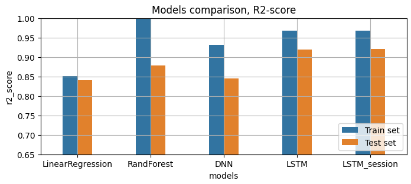

<h1>  Electrical motor temperature prediction with LSTM, DNN, Random Forest, LinRegression</h1> 

# Intorduction

The Permanent Magnet Synchronous Motor (PMSM) is used in many application: electric vehicle, wind turbines, motorcycles: the main advantage of this motors is the low size/weight.  
For the best functionality of the PMSM, the temperature of the rotor/magnetic must be monitored by the controle unite to avoid the overheating of the permanent magnetic.  
Many solutions are possible:
* Measurement by thermocouples and transmission by radio frequency communication.
* Estimation of the rotor temperature by physical models
* ...

One of the new solution is to use the AI/ML or deep learning to estimate/predict the temperature of the rotor, it can be a low cost solution since we delete the temperature sensor + all system of power supply + communication + filters ... and it can be best that the conventional estimator that use the physical equation. the main default of those estimator is that we need the exact model of the motor to be accurate.    
In the below project, we will compare some of regression ML to predict the rotor temperature of the PMSM   
We wil use a [dataset from kaggle](https://www.kaggle.com/datasets/wkirgsn/electric-motor-temperature/data)  
For more information about this database please see the [link](https://ieeexplore.ieee.org/document/9296842)

Below the comparison of the 5 models

